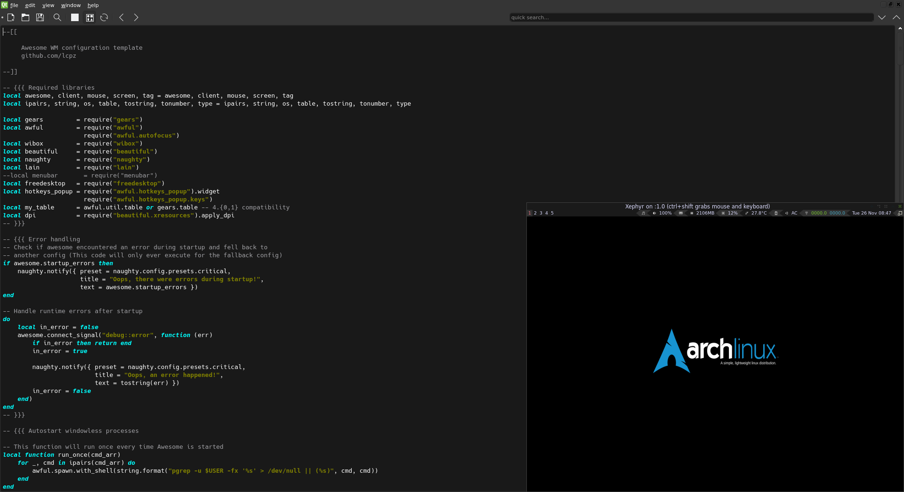

# gratuitous

gra·tu·i·tous `/*ɡrəˈt(y)o͞oədəs*/`

1. uncalled for; lacking good reason; unwarranted. *e.g. a gratuitous insult*

2. given or done free of charge.

gratuitous is an IDE for awesome window manager configs and themes.
The name is a play on the adjective names of the awesome libs (awful, beautiful, vicious)

## Features

* edit lua files with basic syntax highlighting
* search and replace
* tile editor windows
* open a Xephyr preview with optional auto-reload on save
* persistent settings

## Development

This is my first ever project in c++, so there are likely many bugs, anti-patterns, and memory leaks.
If you are a seasoned c++ developer, be nice :)

If you do find any bugs, I would greatly appreciate you taking the time to submit an issue.

Also, feel free to submit a pull request for bugfixes and/or new features.
Have a look at [the todos](TODO.md).
